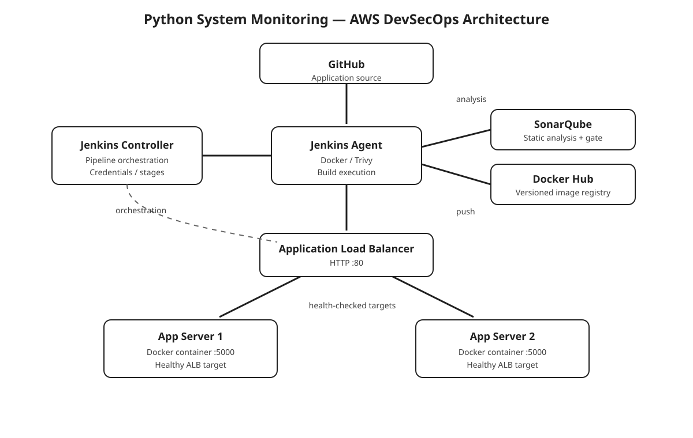
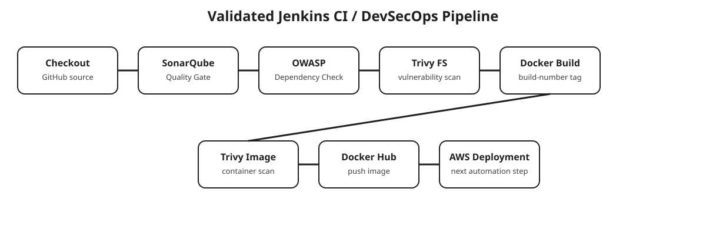

# Python System Monitoring — CI/CD & DevSecOps on AWS


A hands-on DevSecOps implementation around the public [Python System Monitoring](https://github.com/Aj7Ay/Python-System-Monitoring) Flask application.

The application provides system information and realtime monitoring screens. This repository documents the AWS infrastructure, Jenkins CI/security pipeline, container workflow, and deployment path that were implemented for the project.

## Architecture



## CI/CD pipeline



The validated Jenkins pipeline performs:

1. Workspace cleanup
2. Checkout of the application source from GitHub
3. SonarQube static analysis
4. SonarQube Quality Gate
5. OWASP Dependency-Check
6. Trivy filesystem scanning
7. Docker image build
8. Trivy container-image scanning
9. Docker Hub authentication and image push

The Docker image is tagged from the Jenkins build number:

```text
docker.io/cheesepopcorn/python-system-monitoring:<BUILD_NUMBER>
```

## AWS deployment

The container was deployed to two EC2 application servers, both listening on port 5000, and exposed through an internet-facing AWS Application Load Balancer.

```text
Internet
   |
   v
Application Load Balancer :80
      /          \
     v            v
App Server 1   App Server 2
 Docker :5000   Docker :5000
```

The target group uses HTTP health checks against `/` on port 5000.

## Technologies

| Area | Technology |
|---|---|
| Application | Python / Flask |
| CI/CD | Jenkins |
| CI Worker | Jenkins SSH Agent |
| Code Quality | SonarQube |
| Dependency Security | OWASP Dependency-Check |
| Vulnerability / Secret Scanning | Trivy |
| Containerization | Docker |
| Registry | Docker Hub |
| Compute | AWS EC2 |
| Traffic Management | AWS Application Load Balancer |
| Source | GitHub |

## Repository structure

```text
.
├── Jenkinsfile
├── README.md
├── .gitignore
├── docs/
│   ├── architecture.svg
│   ├── pipeline.svg
│   └── deployment.md
└── UPSTREAM.md
```

## Jenkins credentials

Credentials are referenced by Jenkins credential IDs only. No tokens, passwords, private keys, or cloud secrets belong in this repository.

Expected Jenkins credentials used by the pipeline:

- `sonar-token`
- `nvd-api-key`
- `dockerhub-creds`

## Current status

The CI/security stages, Docker image publishing, two-server container deployment, and public ALB access were validated during the project.

The Jenkinsfile currently stops after Docker Hub push. The final automation improvement is to add a deployment stage that updates both EC2 application servers automatically after a successful image push.

## Source attribution

The application used for this DevSecOps project is the public repository:

https://github.com/Aj7Ay/Python-System-Monitoring

This repository focuses on the DevSecOps/AWS implementation around that application. See [UPSTREAM.md](./UPSTREAM.md) for source and license context.
